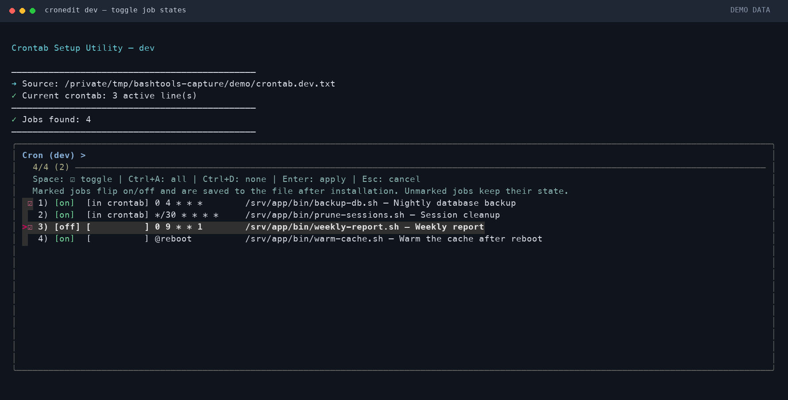
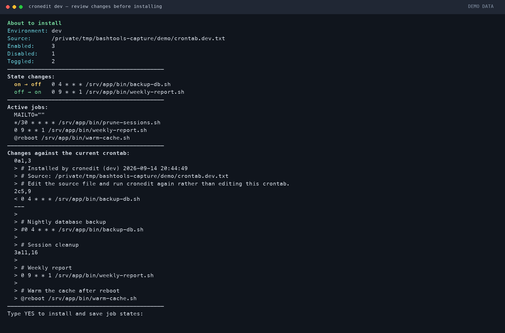
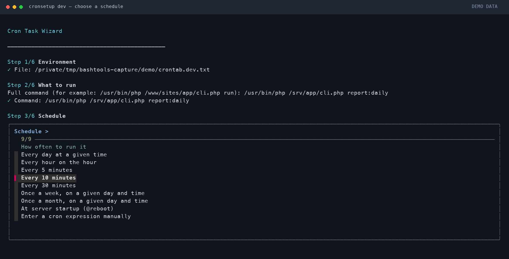

# Cron utilities

Shell tools for creating cron jobs and installing per-environment crontabs.

| Tool | What it does |
| --- | --- |
| [`cronsetup`](cronsetup) | A wizard that builds a cron job from a few questions and appends it to a job file |
| [`cronedit`](cronedit) | An `fzf` picker that toggles and saves job states, installs the crontab, or deletes jobs from the source file |

## Why

Keep development and production schedules in `crontab.dev.txt` and
`crontab.prod.txt`. These files can be versioned in Git and reviewed before
installation. Commented-out jobs remain available in the picker.

Installing replaces the current user's entire crontab with the selected
environment's result; it does not merge environments or preserve unrelated jobs.

## Requirements

- `bash` 3.2 or newer
- [`fzf`](https://github.com/junegunn/fzf) for the interactive pickers
- `cron` for installing (`cronedit --dry-run` works without it)
- Command-line tools: `awk`, `sed`, `grep`, `diff`, `find`, `readlink`, `sort`,
  `cut`, `tail`, `cp`, `mv`, `mktemp`, and `date`; `find` must support `-maxdepth`

```bash
sudo apt install -y fzf cron     # Debian/Ubuntu
brew install fzf                 # macOS
```

## Install

```bash
git clone https://github.com/frontdevops/bashtools.git
sudo ln -s "$PWD/bashtools/cron/cronedit"  /usr/local/bin/cronedit
sudo ln -s "$PWD/bashtools/cron/cronsetup" /usr/local/bin/cronsetup
```

Both tools work through symlinks on `PATH`. Run them from your project's
job-file directory; the location of the installed tool does not affect which
project is selected.

```bash
cd /srv/app
cronsetup dev
cronedit dev
```

## Job files

A job file is an ordinary crontab, kept per environment next to your project:

```
crontab.dev.txt
crontab.prod.txt
```

Both tools read `crontab.<environment>.txt` from the current working directory.
Set `CRONTAB_DIR` to use another directory; relative values are resolved from
the current working directory. If the file is missing there, the command fails
instead of falling back to a demo file next to the installed tool.

```
# Comments above a job become its label in the picker
0 4 * * * /srv/app/bin/backup-db.sh >> /var/log/backup.log 2>&1

# A commented-out job is simply a disabled job
#0 9 * * 1 /srv/app/bin/weekly-report.sh >> /var/log/report.log 2>&1

# Environment lines are carried over untouched
MAILTO=""
```

The repository ships with demo [`crontab.dev.txt`](crontab.dev.txt) and
[`crontab.prod.txt`](crontab.prod.txt) so a fresh clone has something to show.
Replace the examples with your own jobs, or set `CRONTAB_DIR` to your project's
job-file directory.

## cronsetup — add a job

```bash
cronsetup dev
```

Six steps, each a picker or a prompt:

1. **Environment** — `dev` or `prod` (or pass it as an argument)
2. **What to run** — pick an executable found in the project, or type a command
3. **Schedule** — every 5/10/30 minutes, hourly, daily, weekly, monthly, `@reboot`, or a raw cron expression
4. **Where output goes** — a log file, a custom path, `/dev/null`, or leave it for cron to email
5. **Description** — the comment written above the job
6. **State** — add it enabled, or commented out for later

Then it shows what will be written, warns if the same command is already in the
file, and asks for `YES`:

```
New job
File:        /srv/app/crontab.dev.txt
Runs:        every day at 04:30
State:       enabled
Description: backup-db — every day at 04:30

This will be appended to the file:

  # backup-db — every day at 04:30
  30 4 * * * /srv/app/bin/backup-db.sh >> /var/log/backup-db.log 2>&1
```

`cronsetup` never touches the system crontab — it only writes to the file (and
keeps a `.bak` of it). Installing is the next step.

## cronedit — switch jobs on and off, and install

```bash
cronedit dev
```

The picker lists every job in the file: its state in the file, whether that exact
line is in your crontab right now, the schedule, the command, and the comment.

```
 1) [on ] [in crontab] 0 4 * * *        /srv/app/bin/backup-db.sh — Nightly backup
 2) [on ] [          ] */30 * * * *     /srv/app/bin/prune.sh     — Session cleanup
 3) [off] [          ] 0 9 * * 1        /srv/app/bin/report.sh    — Weekly report
```

**Marked jobs flip their state; unmarked jobs keep the state shown in `[on/off]`.**
Mark job 1 and job 3 above and job 1 turns off, job 3 turns on, job 2 is left alone.

Press Space or Tab to mark jobs to toggle, then Enter to review the changes.
The `[on/off]` label shows the saved state before the toggle. If no jobs are
marked, Enter selects the highlighted row. Press Esc to cancel.

After every successful installation, the script runs `crontab -l` and displays
the actual installed crontab for verification.

After you type `YES` and installation succeeds, the new states are saved to the
source file. Its previous contents are backed up to `<source-file>.bak`. The next
run shows the saved states, so a second toggle reverses the first. `--all` also
saves its resulting states. A failed installation leaves the source unchanged;
`--dry-run` and cancellation change neither the source nor the system crontab.

Before anything is installed you get the counts, the list of state changes, the
resulting active jobs, and a diff against the current crontab:

```
Enabled:     2
Disabled:    1
Toggled:     2

State changes:
  on → off   0 4 * * * /srv/app/bin/backup-db.sh
  off → on   0 9 * * 1 /srv/app/bin/report.sh
```

The installed crontab mirrors the file — comments kept, disabled jobs commented
out — so it reads the same as the source:

```
# Installed by cronedit (dev) 2026-09-14 20:02:53
# Source: /srv/app/crontab.dev.txt
# Edit the source file and run cronedit again rather than editing this crontab.

# Nightly backup
#0 4 * * * /srv/app/bin/backup-db.sh >> /var/log/backup.log 2>&1
```

### Options

| Option | Effect |
| --- | --- |
| `--all` | Enable every job, no picker (handy for provisioning) |
| `--dry-run` | Show the result and the diff, install nothing — works without `cron` installed |
| `--delete` | Pick jobs and remove them from the job file, comment included |
| `-h`, `--help` | Usage |

### Deleting a job

```bash
cronedit dev --delete
```

Marked jobs are removed from the job file together with the comment block glued
directly above them; the file is backed up to `crontab.dev.txt.bak` first. Run
`cronedit dev` afterwards to push the change to the system crontab.

To apply the remaining jobs, select any required state changes in the picker.
An empty selection cancels; `cronedit dev --all` installs all remaining jobs
as enabled.

### Rollback

Every install overwrites `.crontab.backup` next to the project's job file with
the previous crontab. Only one crontab backup is kept; source-file `.bak` files
are also overwritten instead of accumulating. Restore the previous crontab with:

```bash
crontab .crontab.backup
```

The crontab backup restores the installed schedule. To restore the previous
source states too, copy `crontab.dev.txt.bak` back to `crontab.dev.txt` (or the
corresponding production file).

## Environment variables

| Variable | Used by | Meaning |
| --- | --- | --- |
| `CRONTAB_DIR` | both | Override the current working directory for `crontab.<env>.txt` |
| `CRON_PATH_PREFIX` | `cronsetup` | Prefix put in front of discovered scripts. Defaults to the project directory, so paths are correct on this machine; set it when the project sits elsewhere on the target server (`CRON_PATH_PREFIX=/www`) |
| `CRON_SCAN_DIR` | `cronsetup` | Where to look for runnable scripts (default: the directory of the job file) |

## Preview without installing

`--dry-run` installs nothing: it reads the demo job files and prints the crontab
they would produce, plus a diff against your current one.

```bash
git clone https://github.com/frontdevops/bashtools.git
cd bashtools/cron

./cronedit dev --all --dry-run
./cronedit prod --all --dry-run
```

```
cron/
├── cronedit           # pick jobs, toggle them, install the crontab
├── cronsetup          # wizard that writes a new job into the file
├── crontab.dev.txt    # jobs for the dev environment
└── crontab.prod.txt   # jobs for the prod environment
```

## File changes and confirmation

- `cronsetup` writes only to the job file, never to the system crontab
- `cronedit` backs the crontab up before every install, and `--delete` backs the job file up before every removal
- Every destructive step needs a typed `YES`; `Esc` in any picker cancels
- `--dry-run` covers both installing and deleting

## Screenshots

Captured from the actual scripts and `fzf` in a demo terminal session. The
crontab data is mocked; no system crontab was installed.

### cronedit — toggle jobs

Only `[on]` is green. Marked jobs will switch states after confirmation.



### cronedit — review changes

Review the state changes and crontab diff before typing `YES`.



### cronsetup — choose a schedule

The wizard builds a job from the command, schedule, output, description, and state.



## License

[MIT](../LICENSE)
