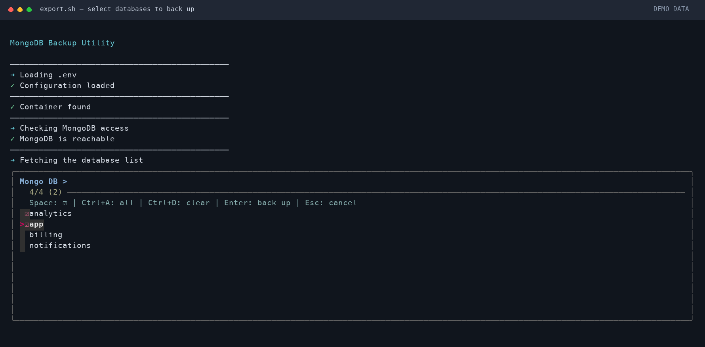
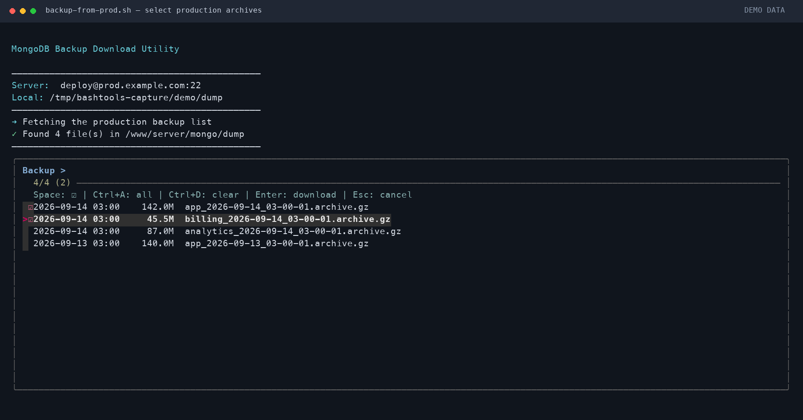
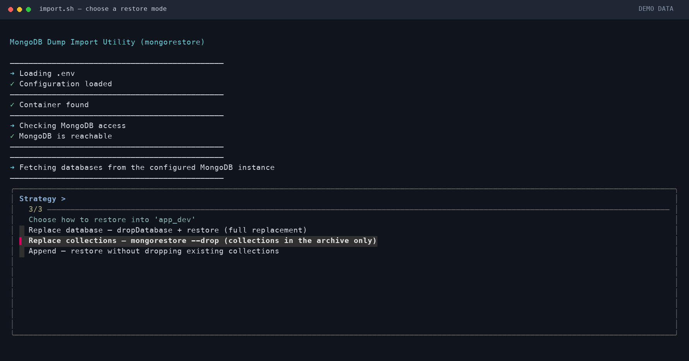
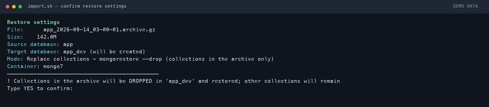

# MongoDB utilities

These scripts create, download, and restore compressed MongoDB archives. They
use `mongodump` and `mongorestore`, not JSON or CSV export and import.

| Script | Purpose |
| --- | --- |
| [export.sh](export.sh) | Back up selected databases from MongoDB through a Docker container. |
| [backup-from-prod.sh](backup-from-prod.sh) | Download existing backup archives over SSH with rsync. |
| [import.sh](import.sh) | Restore an archive to the configured MongoDB instance, optionally under a different database name. |

## Requirements

- Bash. `export.sh` requires Bash 4 or later because it uses `mapfile`.
- `fzf` for interactive selection. The download script does not need it with
  `--all`; the import script does not need it when `--file`, `--db`, and `--mode`
  are all supplied.
- For export and import: Docker access and a running container with `mongosh`
  and the corresponding database tool (`mongodump` or `mongorestore`).
- For downloads: `ssh` and `rsync` locally, SSH access to the source server,
  and `rsync`, `sort`, and GNU `find` on that server. The remote listing uses
  `find -printf`.
- Standard command-line tools such as `awk`, `sed`, `grep`, `stat`, `date`,
  `find`, `sort`, and `du`. Local archive discovery uses `find -maxdepth`.

Run the examples with Bash. On macOS, use Bash 4+ for `export.sh` rather than
Apple's bundled Bash 3.2.

## MongoDB connection settings

`export.sh` and `import.sh` source `.env` from the **current working directory**.
Run them from the directory containing that file, using an absolute script path
if necessary. The file is loaded as shell code and must use Bash-compatible
assignments.

```bash
MONGO_AUTHDB=admin
MONGO_USER=backup_user
MONGO_PASS='replace-with-your-password'
MONGO_HOST=mongo
MONGO_PORT=27017
```

`MONGO_AUTHDB`, `MONGO_USER`, and `MONGO_PASS` are required. `MONGO_HOST` defaults
to `mongo`, and `MONGO_PORT` defaults to `27017`. The connection is made from
inside the Docker container, so the host must be reachable there. The MongoDB
user needs permission for the selected operation and database listing.

The scripts operate on the configured server. Despite the import script's
local-development workflow, it does not enforce a local-only connection.

## export.sh — create archives

```bash
# Run from the directory containing .env.
bash /path/to/bashtools/mongo/export.sh
```

The script loads `.env`, checks the container, and runs a MongoDB ping. It then
lists databases, excluding `admin`, `config`, and `local`, and opens an `fzf`
picker. Press Space to mark databases, Ctrl+A to mark all, Ctrl+D to clear marks,
and Enter to start the backup. If nothing is marked, Enter selects the current
row. Esc cancels.

Each selected database is backed up sequentially with
`docker exec ... mongodump --db <name> --archive --gzip`. Archive data is written
to the host filesystem, one file per database:

```text
/www/server/mongo/dump/app_2026-09-14_03-00-01.archive.gz
```

All files from one run share the timestamp generated when the script starts.
The script creates the output directory, shows progress, checks that each file
is nonempty, and prints its path and size. If `mongodump` fails, it removes the
current partial archive and stops; earlier completed archives remain.

The script initializes `CONTAINER_NAME=mongo7` and
`BACKUP_DIR=/www/server/mongo/dump`. These are script settings, not command-line
options; exporting variables with those names before starting the script does
not override those assignments. The subsequently sourced `.env` can override
them. `MONGO_CONTAINER` is an import-only setting.

There are no command-line options or `--help` handler. Selecting databases and
pressing Enter starts the backup without an additional confirmation prompt.

## backup-from-prod.sh — download archives

This script downloads existing `*.archive.gz` files. It does not create a remote
backup, connect to MongoDB, or restore data, and it does not read `.env`.

```bash
bash /path/to/bashtools/mongo/backup-from-prod.sh \
  --host prod.example.com --user deploy

LOCAL_DIR=/data/mongo bash /path/to/bashtools/mongo/backup-from-prod.sh \
  --host prod.example.com --user deploy \
  --dir /www/server/mongo/dump --all
```

It lists archives over SSH, tries the remote candidate directories in order,
and uses the first directory containing matching files. Files are shown newest
first with their modification time and size. The picker uses Space, Ctrl+A,
Ctrl+D, Enter, and Esc as described above. `--all` bypasses the picker.

After selection, the script displays the file count and total size, creates the
local directory, and downloads each file with `rsync -avP`. It stops on a failed
transfer or an empty downloaded file. There is no additional confirmation.

| Option | Environment variable | Default or behavior |
| --- | --- | --- |
| `--host HOST` | `PROD_HOST` | `127.0.0.1`; set this to the actual source server. |
| `--user USER` | `PROD_USER` | `user` |
| `--port PORT` | `PROD_PORT` | `22` |
| `--dir PATH` | `REMOTE_DIR` | Try `/www/server/mongo/dump`, then `/dump/mongo`. |
| — | `LOCAL_DIR` | `/data/mongo` if that directory exists; otherwise `dump/` next to the script. |
| `--all` | — | Download every archive in the selected remote directory. |
| `--clean` | — | Remove local `*.archive.gz` files before downloading. |
| `-h`, `--help` | — | Show usage and current connection defaults. |

Command-line connection options override their environment values. Remote
directory candidates are interpreted as shell words, and the picker extracts
filenames from space-separated display rows; use directory and archive names
without spaces or shell metacharacters.

`--clean` applies to the resolved `LOCAL_DIR`, including `/data/mongo` or a custom
path. It removes matching archives immediately before transfers, without a
confirmation prompt. Other local files are left in place.

## import.sh — restore an archive

```bash
# Run from the directory containing .env.
bash /path/to/bashtools/mongo/import.sh

# Choose all settings explicitly, but keep the confirmation prompt.
bash /path/to/bashtools/mongo/import.sh \
  --file /data/mongo/app_2026-09-14_03-00-01.archive.gz \
  --db app_dev --mode replace
```

The script loads `.env`, checks MongoDB access, and prompts for any missing
archive, target database, or restore mode. The archive picker lists
`*.archive.gz` files newest first. The target picker offers the source database
name, an existing database, or a manually entered name. System databases
`admin`, `config`, and `local` are rejected as targets.

The source database name comes from the **filename**, not archive metadata:
`app_2026-09-14_03-00-01.archive.gz` becomes `app`. Keep the naming convention
produced by `export.sh`, and use archives containing one database. The restore
command does not add a namespace filter to exclude other databases in an
arbitrary archive.

When source and target names differ, the script passes
`--nsFrom="<source>.*" --nsTo="<target>.*"` to `mongorestore`.

| Mode | Behavior |
| --- | --- |
| `replace` | If the target appears in the database list, call `dropDatabase()` before restoring. This replaces the entire target database, including collections absent from the archive. |
| `drop` | Pass `--drop` to `mongorestore` to replace collections present in the archive. Other target collections remain. |
| `append` | Restore without dropping existing collections. This is not an upsert or an update of existing documents; review restore output for insertion errors. |

The script displays the archive, size, source and target databases, container,
and mode, then requires a typed `YES`. It streams the local archive into
`docker exec -i ... mongorestore --archive --gzip`; no archive copy or volume
mount inside the container is needed. A failed restore stops the script. On
success, it lists the target collections and their document counts.

| Option or variable | Behavior |
| --- | --- |
| `--file PATH` | Select an archive explicitly; relative paths use the current working directory. |
| `--db NAME` | Set the target database instead of opening the target picker. |
| `--mode replace\|drop\|append` | Set the restore mode instead of opening the mode picker. |
| `--yes`, `-y` | Skip the final confirmation; does not fill in missing picker choices. |
| `-h`, `--help` | Show usage without connecting to MongoDB. |
| `MONGO_CONTAINER` | Docker container name; defaults to `mongo7`. Set it in the process environment before starting the script. |
| `DUMP_DIR` | Archive picker directory; defaults to `/data/mongo` if it exists, otherwise `dump/` next to the script. |

For a run without interactive prompts, supply `--file`, `--db`, `--mode`, and
`--yes` together. Import does not create a backup of the target database or
roll back a failed restore. In `replace` mode, a restore failure can leave the
target empty or partially restored after the original database is dropped.

## Screenshots

Captured from the actual scripts and `fzf` in a demo terminal session. MongoDB
and SSH responses are mocked; no real databases were exported or restored, and
no production archives were downloaded.

### export.sh — select databases

Mark one or more databases to create a separate archive for each.



### backup-from-prod.sh — select archives

Review archive dates and sizes, then select the files to download.



### import.sh — choose a restore mode

Choose full database replacement, collection replacement, or append mode.



### import.sh — confirm the restore

Review the source database, target database, and mode before typing `YES`.



## License

[MIT](../LICENSE)
